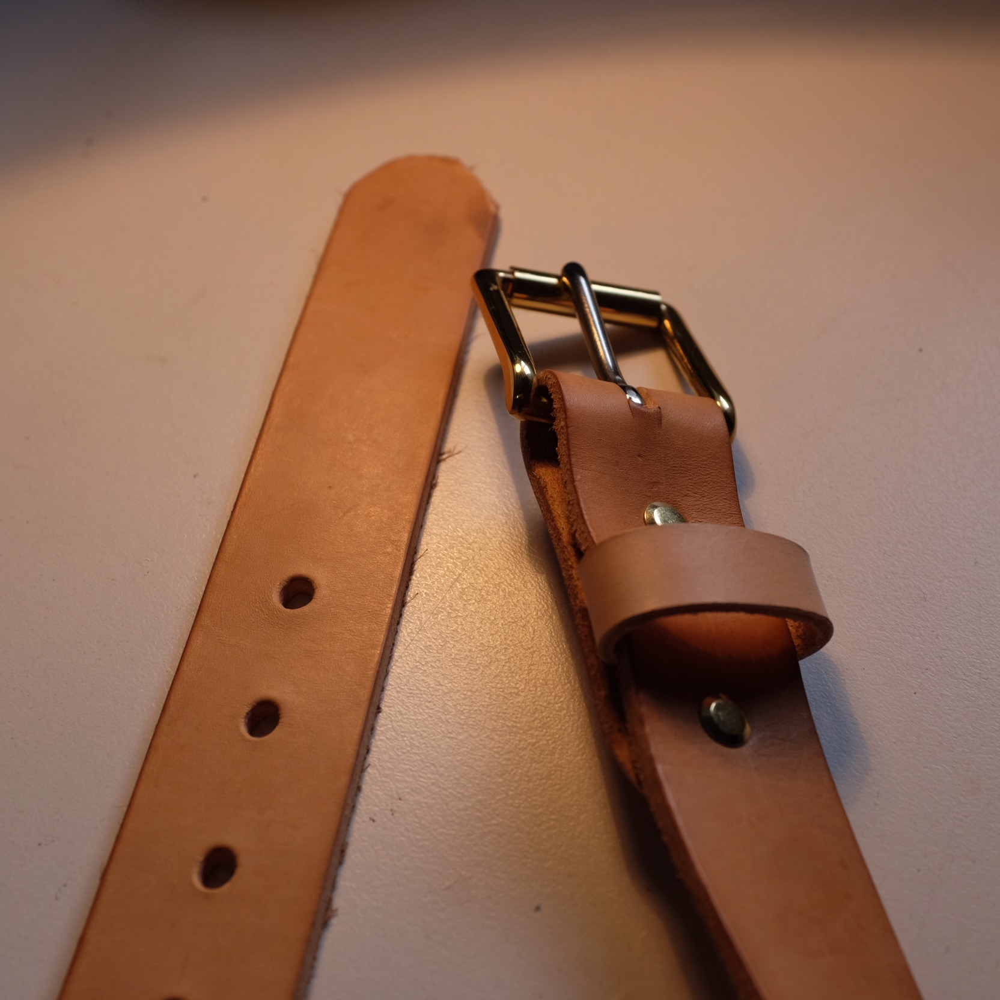

A couple years back I bought an expensive belt from an expensive store. Within 6 months, the belt's buckle had broken, the leather was peeling - I needed a new one.

I thought, how hard can it be to make a good quality leather belt?

So I made my own.

I wanted to use the best, hardwearing materials which take on a patina with time. This meant using:

- Natural, Full Grain Leather
- A Brass Buckle

I made the belt for myself, and 2 years later it has taken on a beautiful patina.

I've now made a few dozen of these belts for friends and family - if you'd like one you can order it [here](https://buy.stripe.com/4gw6oy0rX2NAbp68wx).