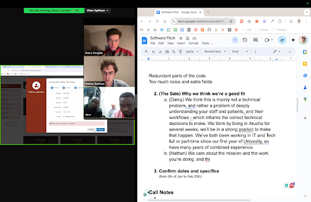

_March 2025_

Imagine if the government didn't do anything. No public transport. No rubbish collection. No paved roads. No piped fresh water. And of course, no healthcare. 

This is more or less what it was like to live in Sub-saharan Africa for 6 weeks.

I travelled with two good friends, Darcy and Patrick, to experience what this part of the world was like, and to help a hospital out with their patient software.

This story began 9 months ago, with Darcy in Vietnam - the most different place I've ever visited. He said to me:
"Picture this but 10 times poorer! What do you think about volunteering in Africa as a grad trip?"

I was in! I didn't think we'd have a decent shot at being useful, but at least I'd be able to experience this very different part of the world, a culture unknown in the West. I was also curious to see if the charities were actually helping people.
 
Through my connection with the Sydney charity Humanitix, we found a lead: the Barbara May Foundation which funded maternity hospitals across Africa. One of those hospitals had a system they absolutely hated.

*Above: us trying to convince the hospital to let us come over*

I thought one of the doctors said "I don't speak Greek", he was actually saying "I don't speak geek!" At least we convinced them we were good with computers. 

Patrick joined later in the piece, after I not so subtly asked him to come with us 10 times. He didn't think charities could do anything useful. I had just about given up, when I mentioned it jokingly the 11th time, and he said "is that a serious offer?" about 1 month before we were supposed to leave. He was in too!

## Touchdown in Nairobi 

I arrived in Africa alone (not by choice - don't fly budget airlines). On my flight to Nairobi I was warned: do not walk anywhere, you will be mugged. Even 50 meters down the street, take an Uber. Don't go to the CBD. Stay in the expat zone - known as "Westlands". Oh, and if customs give you trouble? Just hand over US$10 and that should do the trick.

The first thing that struck me was how polluted the city smelt. Worse than Sydney during the last bushfire season. But this was normal! I found out later that most of Africa burns their rubbish, since the government doesn't collect it. Otherwise, it'll just pile up.

I could also breathe the inequality. Customs was more like a shed. There were no digital face scanners like in Australia. There was a mysterious guy in a trench coat who would manoeuvre people around, letting people skip in front of me as he saw fit. And I saw people hand over money to the customs agent.

After getting my baggage they made me scan it through a machine aptly labelled "Kenya Revenue Authority". I am convinced every single government checkpoint I went through was for getting money, not security.

But nothing prepared me for the first steps walking out of the airport. 

There was a sea of local people, at least a hundred, trying to persuade me to take their taxi. One of the things about Africa is there are people absolutely everywhere. I tried the Uber app, but it wouldn't work. I noticed a man shaking hands, in a friendly way, with the security guy at the entrance. There must have been a tip off that a large international flight had arrived, and I was one of the first off the plane. 

So into the den I went. 

At least 5 people started tugging on my shrink-wrapped bag at once. I tried to pit them off each other, asking for prices. 2500 shillings! 2000 shillings! 1900!

But - and maybe this was part of my mis-judgement of Africa - I was scared of being extorted and/or kidnapped. It was like 1am, to be fair. So I asked for taxi badges. One lady had a very suspicious screenshot of something that looked like a license forwarded to her on Whatsapp. 

Without any better idea, and no one I could trust, I walked back to the entrance, telling the people following me very clearly "no!" and chatted to the security guard. He said, probably to try and convince me to choose a driver he'd get a commission from, that "it is very dangerous to get into a taxi with someone you don't know, and that he could introduce me to a good driver". I was already sold. He introduced me to the guy he shook hands with earlier. 

## On the Way to the Hotel

I tried to negotiate - but for being white, a "wazungu", as they call it, it feels like there's this pot of gold on my head which makes everyone want to ridiculously over quote me and talk in a way which I think Australians would find manipulative. Sure, I'll quote you 5 times the market rate, but I'll say make a special deal - no profit - since you are my friend and I want you to come back to Africa in the future. All while constantly smiling in a pretty creepy way, which I learnt was pretty normal.

The driver tells me about the training course he had to do while we wait for his taxi, and that I was a good man for supporting the legitamate taxi industry. He calls some number from a list on Whatsapp. A yellow cab pops up, a driver comes out and my driver replaces him. There must be some car sharing arrangement? He makes me sit in the front, he seems to want to show me his list of prices (to show he isn't making it up) in the glovebox while he is driving which scares me a little bit.

But probably, out of all this, what shocked me the most was arriving at the hotel.

It was a fortress! About 5 security guards came and opened the gate, and stopped the car before it could drive in. They opened the doors with massive searchlights, which I found out later was to check for bombs. Another impact of not really having a functioning government or border security is that everywhere (at least where wealthy people go)  have insane private security.

Arriving at the hotel entrance, I paid the driver with the cash I had on me, and of course he didn't have change. Not one taxi driver had change in my time in Africa! 

I arrived in the lobby, which was something more like airport security. There was man with an AK-47 who told me to drop my bags and release metallic items. 

It was such a relief to see my friends.

I still finished the night somewhat terrified, looking through the Wikipedia list of terror attacks in Nairobi, several which happened in a few hundred meters of the hotel we were staying at, and none were reported in the news in Australia.

_To be continued..._
